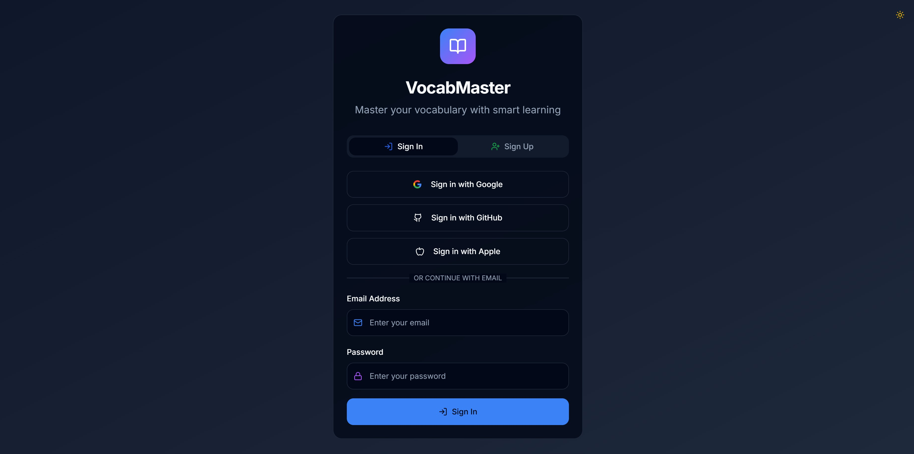
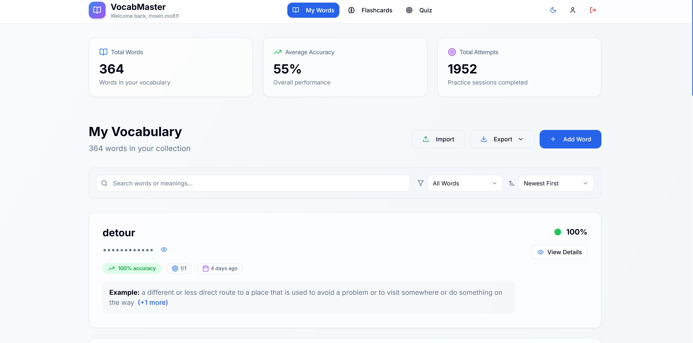
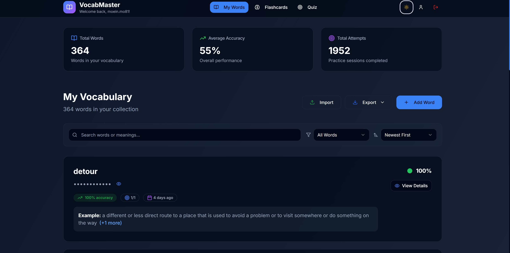
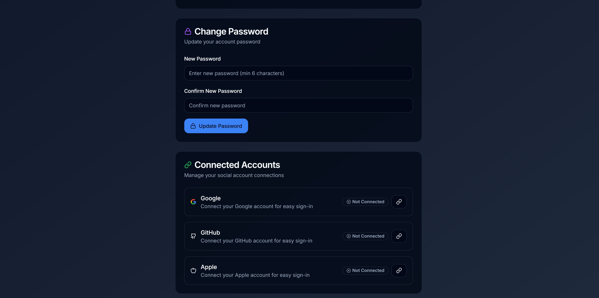

# English Vocabulary memorization

*Automatically synced with your [v0.dev](https://v0.dev) deployments*

## Overview

This repository will stay in sync with your deployed chats on [v0.dev](https://v0.dev).
Any changes you make to your deployed app will be automatically pushed to this repository from [v0.dev](https://v0.dev).

## Screenshots

  
  
  
  

## Deployment

Your project is live at:

**[https://vercel.com/ilovebacterias-projects/v0-modern-kokonut-ui-design](https://vercel.com/ilovebacterias-projects/v0-modern-kokonut-ui-design)**

## Build your app

Continue building your app on:

**[https://v0.dev/chat/projects/fol5Cyab2SF](https://v0.dev/chat/projects/fol5Cyab2SF)**

## How It Works

1. Create and modify your project using [v0.dev](https://v0.dev)
2. Deploy your chats from the v0 interface
3. Changes are automatically pushed to this repository
4. Vercel deploys the latest version from this repository
